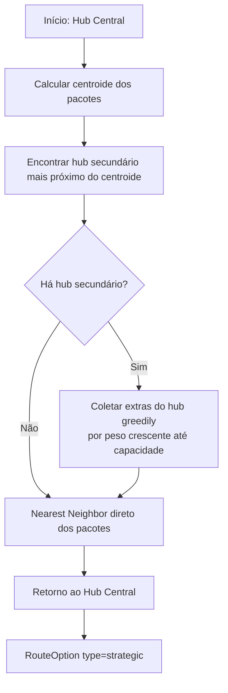

# Algoritmos de Roteirização — FastTrack

## Sumário

1. [Estruturas de Dados](#1-estruturas-de-dados)
2. [Validação de Peso](#2-validação-de-peso)
3. [Resolução do Hub Central](#3-resolução-do-hub-central)
4. [Rota Expressa](#4-rota-expressa)
5. [Rota Econômica](#5-rota-econômica)
6. [Rota Estratégica (Cross-Docking)](#6-rota-estratégica-cross-docking)
7. [Comparação de Trade-offs](#7-comparação-de-trade-offs)
8. [Teste Crítico de Correção](#8-teste-crítico-de-correção)

---

## 1. Estruturas de Dados

Todos os algoritmos operam sobre **dataclasses Python puras** — sem dependências de framework.
As classes ORM (SQLAlchemy) são convertidas antes de chegar ao módulo `routing/`.

### `Point` — `routing/geometry.py`

```python
@dataclass
class Point:
    x: float
    y: float

    def distance_to(self, other: Point) -> float:
        return math.sqrt((self.x - other.x)**2 + (self.y - other.y)**2)
```

Distância euclidiana no plano cartesiano. Sem projeção geográfica — adequado para
o domínio simulado deste projeto.

### `Stop` — `routing/geometry.py`

```python
@dataclass
class Stop:
    id: str       # UUID do recurso ou "hub-central"
    label: str    # Nome para exibição no frontend
    x: float
    y: float
```

Parada ordenada que compõe a lista `RouteOption.stops`.

### `PackageData`, `VehicleData`, `HubData` — `routing/models.py`

Espelhos leves dos modelos ORM, sem dependências de banco.

```python
@dataclass
class PackageData:
    id: UUID
    recipient_name: str
    x: float
    y: float
    weight: float
    access_cost: float   # Custo adicional de acesso (pedágio, área restrita, etc.)

@dataclass
class VehicleData:
    id: UUID
    max_weight: float

@dataclass
class HubData:
    id: UUID
    name: str
    x: float
    y: float
    is_central: bool
    packages: list[PackageData]  # Pacotes disponíveis para coleta (hubs secundários)
```

### `RouteOption` — `routing/models.py`

Resultado produzido por qualquer estratégia:

```python
@dataclass
class RouteOption:
    type: Literal["express", "economic", "strategic"]
    stops: list[Stop]
    total_distance: float   # Distância total incluindo retorno ao hub
    total_cost: float       # Σ(dist_segmento + access_cost) para cada parada de pacote
    total_weight: float     # Peso total (pode incluir extras na estratégica)
```

> **Nota:** `total_cost` exclui o segmento de retorno ao hub. Isso permite comparar
> o custo operacional de entrega de forma justa entre as estratégias.

---

## 2. Validação de Peso

```python
def validate_weight(packages: list[PackageData], vehicle: VehicleData) -> float:
    total = sum(p.weight for p in packages)
    if total > vehicle.max_weight:
        raise WeightLimitExceededException(total_weight=total, max_weight=vehicle.max_weight)
    return total
```

Chamada pelo endpoint `POST /routes/` **antes** de qualquer estratégia ser executada.
Resultado: HTTP 422 com `error_code=WEIGHT_LIMIT_EXCEEDED` se o peso exceder a capacidade.

> Os pacotes extras coletados na Rota Estratégica (cross-docking) têm sua própria
> validação de capacidade residual dentro da estratégia — nunca excedem `max_weight`.

---

## 3. Resolução do Hub Central

As três estratégias compartilham a mesma lógica de identificação do hub central
via a função `resolve_central_hub`:

```python
def resolve_central_hub(hubs: list[HubData]) -> tuple[Point, str, str]:
    hub_central = next((h for h in hubs if h.is_central), None)
    if hub_central is not None:
        return Point(hub_central.x, hub_central.y), str(hub_central.id), hub_central.name
    return Point(0.0, 0.0), "hub-central", "Hub Central"
```

**Fallback:** se nenhum hub com `is_central=True` for fornecido, a origem é `(0, 0)`.

---

## 4. Rota Expressa

**Arquivo:** `routing/express.py`
**Classe:** `ExpressRouteStrategy`

### Objetivo

Minimizar a **distância euclidiana total** percorrida, independentemente do custo de acesso
aos endereços.

### Heurística: Nearest Neighbor por distância

$$\text{next} = \arg\min_{p \in \text{não visitados}} \text{distance}(\text{current}, p)$$

### Pseudocódigo

```
FUNÇÃO express(vehicle, packages, hubs):
  (start, hub_id, hub_label) ← resolve_central_hub(hubs)
  stops ← [hub_stop]
  current ← start
  not_visited ← cópia de packages
  total_distance ← 0
  total_cost ← 0

  ENQUANTO not_visited não estiver vazio:
    nearest ← argmin{ distance(current, p) } para p em not_visited
    seg_dist ← distance(current, nearest)
    total_distance += seg_dist
    total_cost += seg_dist + nearest.access_cost   # inclui no custo mas ignora na ordenação
    stops.append(Stop(nearest))
    current ← nearest
    not_visited.remove(nearest)

  total_distance += distance(current, start)        # retorno ao hub
  stops.append(hub_stop)                            # parada de retorno

  RETORNAR RouteOption(type="express", stops, total_distance, total_cost, total_weight)
```

### Complexidade

- **Tempo:** O(n²) — para cada passo, percorre todos os não-visitados
- **Espaço:** O(n) — lista de paradas

### Trade-off

| ✅ Vantagem | ⚠️ Desvantagem |
|---|---|
| Menor distância total | Pode visitar endereços caros cedo (alto `access_cost`) |
| Simples e determinístico | Não é ótimo global — heurística gulosa |
| O(n²) — rápido para n pequeno | Pode ser ineficiente para frotas grandes |

---

## 5. Rota Econômica

**Arquivo:** `routing/economic.py`
**Classe:** `EconomicRouteStrategy`

### Objetivo

Minimizar o **custo operacional total**, penalizando endereços com alto `access_cost`.

### Heurística: Nearest Neighbor por custo ponderado

$$\text{cost}(p) = w_d \cdot \text{distance}(\text{current}, p) + w_a \cdot p.\text{access\_cost}$$

$$\text{next} = \arg\min_{p \in \text{não visitados}} \text{cost}(p)$$

**Pesos padrão:** $w_d = 1.0$, $w_a = 1.0$ (configuráveis via construtor).

### Pseudocódigo

```
FUNÇÃO economic(vehicle, packages, hubs, w_d=1.0, w_a=1.0):
  (start, hub_id, hub_label) ← resolve_central_hub(hubs)
  stops ← [hub_stop]
  current ← start
  not_visited ← cópia de packages

  ENQUANTO not_visited não estiver vazio:
    cheapest ← argmin{ w_d × distance(current, p) + w_a × p.access_cost }
                  para p em not_visited
    seg_dist ← distance(current, cheapest)
    total_distance += seg_dist
    total_cost += seg_dist + cheapest.access_cost
    stops.append(Stop(cheapest))
    current ← cheapest
    not_visited.remove(cheapest)

  total_distance += distance(current, start)
  stops.append(hub_stop)

  RETORNAR RouteOption(type="economic", stops, total_distance, total_cost, total_weight)
```

### Efeito prático

Com $w_d = w_a = 1.0$, pacotes com `access_cost` muito alto são "empurrados para o fim"
da rota — o algoritmo prefere entregar primeiro pacotes baratos e próximos,
deixando os caros para quando já estiver perto deles ou sem alternativas.

### Relação com a Rota Expressa

- **Expressa** minimiza distância → `total_distance < economic.total_distance` (em geral)
- **Econômica** minimiza custo → `total_cost ≤ express.total_cost` (em geral)

> Essa relação é **provada matematicamente** pelo teste `test_route_comparison.py`
> com um fixture específico. Ver [Seção 8](#8-teste-crítico-de-correção).

### Trade-off

| ✅ Vantagem | ⚠️ Desvantagem |
|---|---|
| Menor custo operacional total | Distância pode ser maior que a Expressa |
| Flexível via parâmetros `w_d`, `w_a` | Ainda é heurística gulosa — não ótimo global |

---

## 6. Rota Estratégica (Cross-Docking)

**Arquivo:** `routing/strategic.py`
**Classe:** `StrategicCrossDockingStrategy`

### Objetivo

Maximizar a **utilização do veículo** fazendo um desvio planejado por um hub secundário
para coletar pacotes extras disponíveis no depósito daquele hub.

### Algoritmo



### Pseudocódigo detalhado

```
FUNÇÃO strategic(vehicle, packages, hubs):
  (start, hub_id, hub_label) ← resolve_central_hub(hubs)
  secondary_hubs ← [h para h em hubs SE NÃO h.is_central]
  extra_packages ← []
  nearest_hub ← None

  SE secondary_hubs E packages NÃO VAZIO:
    center ← centroid([Point(p.x, p.y) para p em packages])
    nearest_hub ← argmin{ distance(center, h) } para h em secondary_hubs

    remaining_capacity ← vehicle.max_weight - sum(p.weight para p em packages)
    PARA pkg em sorted(nearest_hub.packages, key=peso_crescente):
      SE pkg.weight ≤ remaining_capacity:
        extra_packages.append(pkg)
        remaining_capacity -= pkg.weight

  all_packages ← packages + extra_packages

  stops ← [hub_stop]
  current ← start

  SE nearest_hub NÃO É None:
    total_distance += distance(start, nearest_hub)
    stops.append(Stop(nearest_hub))
    current ← nearest_hub

  not_visited ← cópia de all_packages
  ENQUANTO not_visited não estiver vazio:                 # Nearest Neighbor
    nearest ← argmin{ distance(current, p) } para p em not_visited
    seg_dist ← distance(current, nearest)
    total_distance += seg_dist
    total_cost += seg_dist + nearest.access_cost
    stops.append(Stop(nearest))
    current ← nearest
    not_visited.remove(nearest)

  total_distance += distance(current, start)
  stops.append(hub_stop)

  RETORNAR RouteOption(type="strategic", stops, total_distance, total_cost, total_weight)
```

### Invariantes garantidos

1. **Sem violação de capacidade:** a coleta greedy acumula apenas pacotes que cabem na capacidade residual
2. **Sem hub → entrega direta:** se não houver hub secundário, a rota é idêntica à Expressa (sem desvio)
3. **Hub sem extras compatíveis:** o hub aparece na rota mas `extra_packages` fica vazio

### Coleta greedy (Estratégia de Seleção)

Pacotes do hub secundário são ordenados por **peso crescente** antes da coleta. Isso maximiza
o número de itens coletados (bin packing greedy com menor-peso-primeiro).

$$\text{extras} = \text{greedy\_fill}(\text{hub.packages}, \text{remaining\_capacity})$$

### Trade-off

| ✅ Vantagem | ⚠️ Desvantagem |
|---|---|
| Consolida carga — mais entregas por viagem | Distância total maior (inclui desvio pelo hub) |
| Menor custo unitário por pacote (diluído) | Mais complexo — depende de hubs secundários cadastrados |
| Adequado para logística de última milha | Greedy de coleta pode não ser ótimo global |

---

## 7. Comparação de Trade-offs

```
                   Distância    Custo Total   Carga Coletada
Expressa:          ★★★★★       ★★★           ★★★
Econômica:         ★★★★        ★★★★★         ★★★
Estratégica:       ★★          ★★★★          ★★★★★
```

| Estratégia | Otimiza | Penaliza | Ideal quando |
|---|---|---|---|
| **Expressa** | Distância total | Alto `access_cost` ignorado | Urgência / janela de tempo curta |
| **Econômica** | Custo operacional | Distância pode aumentar | Redução de custos, rotas com pedágios |
| **Estratégica** | Consolidação de carga | Distância cresce com o desvio | Volume alto, cross-docking disponível |

---

## 8. Teste Crítico de Correção

**Arquivo:** `tests/routing/test_route_comparison.py`

O teste `test_express_distance_lt_economic_distance` prova matematicamente que,
para o fixture correto, a Rota Expressa tem **distância menor** e a Econômica tem
**custo total menor**:

### Fixture projetado para provar o trade-off

```
Hub Central: (0, 0)

Package A: (2, 0) — perto,    access_cost = 200   (acesso muito caro)
Package B: (8, 6) — longe,    access_cost = 0     (acesso livre)
Package C: (9, 0) — longe,    access_cost = 0     (acesso livre)
```

**Rota Expressa** (ordena por distância):
```
(0,0) → A(2,0) → C(9,0) → B(8,6) → (0,0)
Distância ≈ 2.0 + 7.0 + 6.08 + 10.0 = 25.08
Custo     = (2.0+200) + (7.0+0) + (6.08+0) = 215.08
```

**Rota Econômica** (penaliza access_cost=200 de A):
```
(0,0) → C(9,0) → B(8,6) → A(2,0) → (0,0)
Distância ≈ 9.0 + 6.08 + 7.21 + 2.83 = 25.57  > express ✅
Custo     = (9.0+0) + (6.08+0) + (7.21+200) = 222.29  < press ✅
```

> A prova geométrica confirma que Expressa < Econômica em distância, mas
> Econômica < Expressa em custo quando existe pacote de alto `access_cost`.
