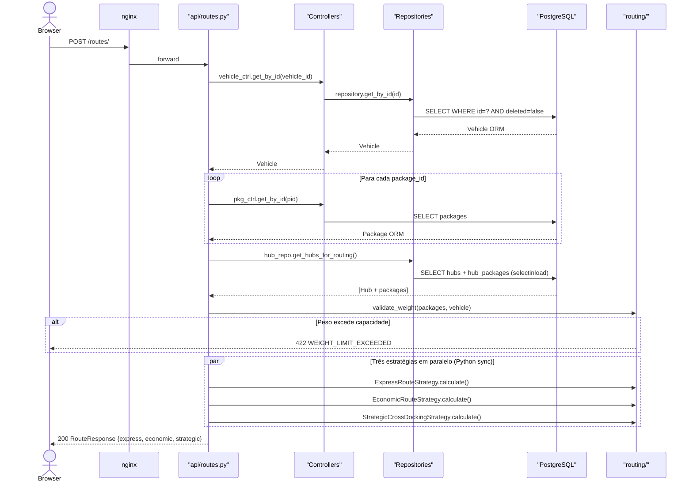
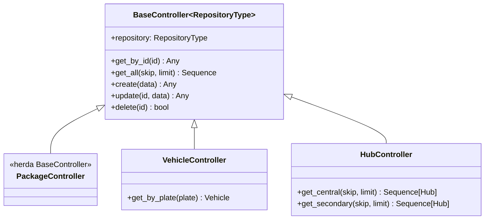
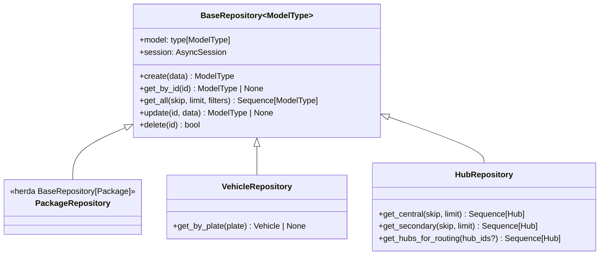
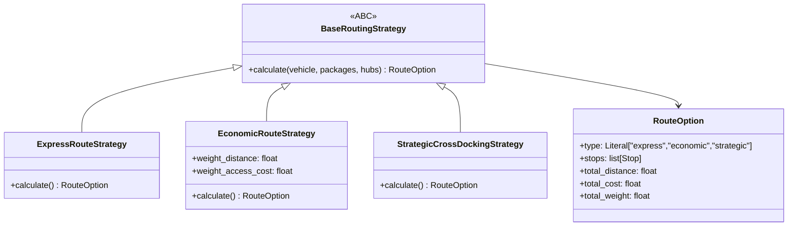
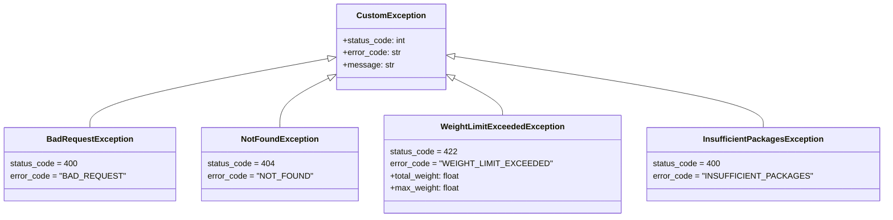

# Arquitetura — FastTrack

## Sumário

1. [Estilo Arquitetural](#1-estilo-arquitetural)
2. [Diagrama de Componentes](#2-diagrama-de-componentes)
3. [Fluxo de Requisição](#3-fluxo-de-requisição)
4. [Camada de API](#4-camada-de-api)
5. [Camada de Controllers](#5-camada-de-controllers)
6. [Camada de Repositories](#6-camada-de-repositories)
7. [Módulo de Roteirização](#7-módulo-de-roteirização)
8. [Injeção de Dependência (Factory)](#8-injeção-de-dependência-factory)
9. [Camada de Dados](#9-camada-de-dados)
10. [Tratamento de Erros](#10-tratamento-de-erros)
11. [Padrões de Projeto Aplicados](#11-padrões-de-projeto-aplicados)
12. [Estrutura de Testes](#12-estrutura-de-testes)

---

## 1. Estilo Arquitetural

FastTrack adota **arquitetura em camadas (N-tier) + Repository Pattern** — um estilo
consolidado para APIs REST que separa claramente responsabilidades de roteamento HTTP,
lógica de negócio e acesso a dados.

```
┌─────────────────────────────────────────────────────────┐
│                     HTTP / ASGI                         │
├─────────────────────────────────────────────────────────┤
│  Camada de API           api/                           │
│  (FastAPI Routers)       packages.py, vehicles.py,      │
│                          hubs.py, routes.py             │
├─────────────────────────────────────────────────────────┤
│  Camada de Controllers   app/controllers/               │
│  (Lógica de negócio)     BaseController + concretos     │
├─────────────────────────────────────────────────────────┤
│  Camada de Repositories  app/repositories/ +            │
│  (Acesso a dados)        core/repository/base.py        │
├─────────────────────────────────────────────────────────┤
│  Camada de Dados         PostgreSQL 16 via asyncpg      │
│  (SQLAlchemy async)      BaseDBModel + modelos concretos│
└─────────────────────────────────────────────────────────┘

Módulo Transversal:
┌─────────────────────────────────────────────────────────┐
│  routing/    (algoritmos — sem dependências de framework)│
│  geometry.py, models.py, base.py                        │
│  express.py, economic.py, strategic.py                  │
└─────────────────────────────────────────────────────────┘
```

**Princípios-guia:**
- **SRP**: cada classe tem uma única responsabilidade
- **DIP**: camadas superiores dependem de abstrações (`BaseController`, `BaseRepository`, `BaseRoutingStrategy`), não de implementações
- **OCP**: novas estratégias de rota, repositórios e controllers se adicionam sem alterar o código existente
- **DRY**: `BaseController` e `BaseRepository` genéricos eliminam CRUD duplicado; `resolve_central_hub` centraliza a lógica de hub

---

## 2. Diagrama de Componentes

```mermaid
graph TB
    subgraph "Frontend (React + Redux)"
        Browser["Browser\n:5173"]
        Store["Redux Store\n(4 slices)"]
        API_Client["api/\n(axios)"]
        Browser --> Store
        Store --> API_Client
    end

    subgraph "nginx"
        Nginx["nginx:alpine\n:5173 → :80"]
    end

    subgraph "Backend (FastAPI)"
        Router["API Routers\napi/"]
        Ctrl["Controllers\napp/controllers/"]
        Repo["Repositories\napp/repositories/"]
        Routing["routing/\nStrategy Pattern"]
        Factory["Factory\nDI via partial()"]
        Core["core/\nconfig, DB, exceptions"]
    end

    subgraph "Dados"
        PG["PostgreSQL 16\n:5432"]
    end

    Browser -->|SPA assets| Nginx
    API_Client -->|/api/*| Nginx
    Nginx -->|proxy_pass| Router
    Router -->|Depends(Factory)| Factory
    Factory --> Ctrl
    Ctrl --> Repo
    Ctrl --> Routing
    Repo -->|SQLAlchemy async| PG
    Router --> Core
```

---

## 3. Fluxo de Requisição

### Caso: POST /routes/



---

## 4. Camada de API

**Localização:** `backend/api/`

Cada arquivo define um `APIRouter` com prefixo e tag correspondente ao recurso.
Os handlers são funções `async` que recebem o controller via `Depends(factory.get_*_controller)`.

```python
# Padrão de cada endpoint
@router.post("/", response_model=PackageResponse, status_code=201)
async def create_package(
    body: PackageCreate,
    ctrl: PackageController = Depends(factory.get_package_controller),
) -> PackageResponse:
    return await ctrl.create(body.model_dump())
```

**Responsabilidades:**
- Deserialização de request (Pydantic faz automaticamente)
- Delegação ao controller
- Serialização de response (Pydantic + `from_attributes=True`)
- **Não contém lógica de negócio**

**Arquivo `routes.py`** — único endpoint de roteirização:
- Busca veículo, pacotes e hubs via controllers/repositories
- Converte ORM → dataclasses de domínio (`_to_package_data`, `VehicleData`, `HubData`)
- Valida peso total (`validate_weight`)
- Executa as 3 estratégias e monta `RouteResponse`

---

## 5. Camada de Controllers

**Localização:** `backend/core/controller/base.py` + `backend/app/controllers/`



**Contrato de erros:** qualquer `None` retornado pelo repository lança `NotFoundException` (HTTP 404).

---

## 6. Camada de Repositories

**Localização:** `backend/core/repository/base.py` + `backend/app/repositories/`



**Convenções:**
- `deleted == False` é filtrado automaticamente em `get_by_id` e `get_all`
- `delete()` → soft-delete (seta `deleted=True`), nunca `DELETE` físico
- `update()` ignora campos `None` (semântica PATCH parcial)
- `get_hubs_for_routing()` usa `selectinload(Hub.packages)` explícito para evitar `MissingGreenlet` em contexto async

---

## 7. Módulo de Roteirização

**Localização:** `backend/routing/`

O módulo `routing/` é **completamente desacoplado do framework**. Não importa FastAPI, SQLAlchemy nem nenhuma dependência de infraestrutura — opera apenas com dataclasses Python puras.



**Fluxo de dados:**
```
ORM models (Package, Vehicle, Hub)
    ↓ _to_package_data() / VehicleData / HubData
Dataclasses de domínio (routing/models.py)
    ↓ Strategy.calculate()
RouteOption (routing/models.py)
    ↓ _to_option_response()
RouteOptionResponse (app/schemas/route.py)
```

> Ver [`ALGORITHMS.md`](ALGORITHMS.md) para detalhes dos algoritmos.

---

## 8. Injeção de Dependência (Factory)

**Localização:** `backend/core/factory/factory.py`

O padrão `Factory` com `functools.partial` pré-vincula o modelo SQLAlchemy ao repositório,
aguardando apenas a sessão async (injetada pelo FastAPI via `Depends`):

```python
class Factory:
    _package_repo = partial(PackageRepository, Package)
    _vehicle_repo = partial(VehicleRepository, Vehicle)
    _hub_repo     = partial(HubRepository, Hub)

    def get_package_controller(
        self, session: AsyncSession = Depends(get_session)
    ) -> PackageController:
        return PackageController(self._package_repo(session))
```

**Benefícios:**
- Uma instância de `Factory()` por router (escopo de módulo)
- Cada request recebe uma `AsyncSession` isolada (escopo de request)
- Testável: `app.dependency_overrides[get_session]` substitui o banco por SQLite in-memory
- Extensível: adicionar novos recursos não altera a interface pública

---

## 9. Camada de Dados

### BaseDBModel

Todos os modelos de negócio herdam de `BaseDBModel`, que fornece:

| Campo | Tipo | Descrição |
|---|---|---|
| `id` | `UUID` (gerado no Python) | Chave primária — compatível com SQLite em testes |
| `deleted` | `Boolean` | Soft-delete flag — `True` oculta o registro de todas as queries |
| `created_at` | `DateTime(timezone=True)` | Timestamp UTC de criação |

### Engine e Session

```python
engine = create_async_engine(
    settings.database_url,
    echo=settings.debug,
    pool_pre_ping=True,        # Valida conexões antes de usar (importante com PostgreSQL)
)
_session_factory = async_sessionmaker(engine, expire_on_commit=False)
```

`expire_on_commit=False` garante que os objetos ORM permaneçam acessíveis após o commit
sem disparar queries adicionais — essencial para async.

### Migrações (Alembic)

- `alembic/env.py` configurado com `create_async_engine` (não o engine síncrono padrão)
- `run_async_migrations()` roda dentro de `asyncio.run()`
- Migração inicial `7061ef8dc7e2`: cria `packages`, `vehicles`, `hubs`, `hub_packages`
- Executada automaticamente no startup do container via `poetry run alembic upgrade head`

---

## 10. Tratamento de Erros

**Localização:** `backend/core/exceptions/`



O handler global `add_exception_handlers(app)` captura qualquer `CustomException` e retorna:

```json
{
  "error_code": "WEIGHT_LIMIT_EXCEEDED",
  "message": "Total weight 110.00kg exceeds vehicle capacity of 100.00kg.",
  "details": { "total_weight": 110.0, "max_weight": 100.0 }
}
```

---

## 11. Padrões de Projeto Aplicados

| Padrão | Onde | Benefício |
|---|---|---|
| **Strategy** | `routing/base.py` + estratégias concretas | Adicionar nova estratégia de rota sem alterar controller |
| **Repository** | `core/repository/base.py` + concretos | Desacopla lógica de negócio do acesso a dados |
| **Factory** | `core/factory/factory.py` | DI centralizada; facilita testes com mocks |
| **Template Method** | `BaseController.get_by_id` → raise `NotFoundException` | Comportamento padrão com customização nos filhos |
| **Partial Application** | `functools.partial(Repository, Model)` | Pré-vincula dependência sem instanciação prematura |
| **Soft Delete** | `BaseDBModel.deleted` + filtro automático | Auditoria e reversibilidade sem DELETE físico |

---

## 12. Estrutura de Testes

Os testes usam **SQLite in-memory** via `aiosqlite` — sem necessidade de PostgreSQL em execução.

```python
# conftest.py — substituição do engine de produção
@pytest.fixture
async def session(test_engine):
    async with async_sessionmaker(test_engine)() as s:
        yield s

# Override da dependência FastAPI
app.dependency_overrides[get_session] = lambda: session
```

**Pirâmide de testes:**

```
          /\
         /  \   43 testes de integração (api/)
        /    \  HTTP real via httpx.AsyncClient
       /------\
      /        \ 31 testes de app (app/)
     / app/     \ models, repos, controllers com SQLite
    /------------\
   /              \ 40 testes unitários (routing/)
  / routing/       \ dataclasses puras, sem banco
 /------------------\
/                    \ 30 testes unitários (core/)
/ core/ + factory/    \ genéricos, BaseRepository etc.
```
