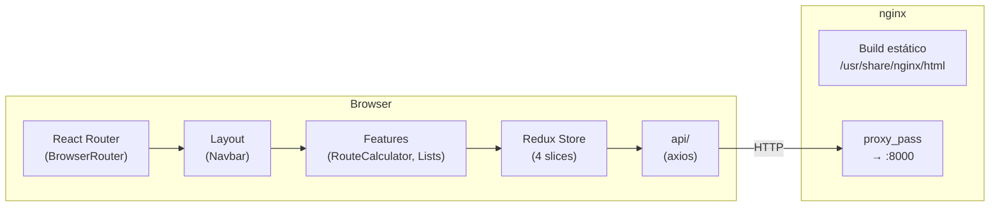
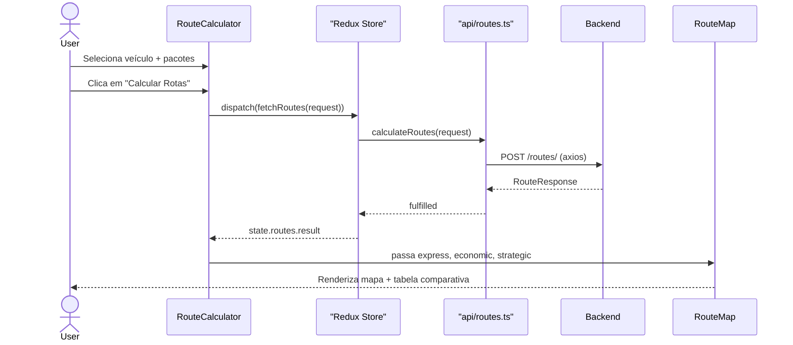

# Arquitetura do Frontend — FastTrack

## Sumário

1. [Visão Geral](#1-visão-geral)
2. [Estrutura de Pastas](#2-estrutura-de-pastas)
3. [Fluxo de Dados](#3-fluxo-de-dados)
4. [Redux Store](#4-redux-store)
5. [Camada de API (axios)](#5-camada-de-api-axios)
6. [Feature-Based Components](#6-feature-based-components)
7. [Visualização Cartesiana (Recharts)](#7-visualização-cartesiana-recharts)
8. [Roteamento SPA](#8-roteamento-spa)
9. [Tipagem TypeScript](#9-tipagem-typescript)
10. [Build e Entrega](#10-build-e-entrega)
11. [Testes (Vitest)](#11-testes-vitest)

---

## 1. Visão Geral

O frontend é uma **Single Page Application (SPA)** construída com React 19 + TypeScript,
organizada por features (feature-based architecture), com estado global gerenciado
por Redux Toolkit e comunicação com a API via axios.



---

## 2. Estrutura de Pastas

```
frontend/src/
├── main.tsx              # Entry point — monta <AppRouter />
├── App.tsx               # Wrapper mínimo
├── types/
│   └── index.ts          # Interfaces TypeScript — espelham schemas do backend
├── api/
│   ├── client.ts         # axios pré-configurado (baseURL, timeout)
│   ├── packages.ts       # listPackages, createPackage, deletePackage, ...
│   ├── vehicles.ts       # listVehicles, createVehicle, ...
│   ├── hubs.ts           # listHubs, createHub, ...
│   └── routes.ts         # calculateRoutes
├── store/
│   ├── index.ts          # configureStore + RootState + AppDispatch
│   └── slices/
│       ├── packagesSlice.ts   # items, loading, error + thunks
│       ├── vehiclesSlice.ts
│       ├── hubsSlice.ts
│       └── routesSlice.ts     # result, loading, error + clearRoutes
├── router/
│   └── index.tsx         # BrowserRouter com 4 rotas + Redux Provider
├── components/
│   └── Layout.tsx        # Navbar com NavLink ativo
└── features/
    ├── routes/
    │   ├── RouteCalculator.tsx   # Form: vehicle + packages + dispatch
    │   └── RouteMap.tsx          # Recharts ComposedChart + tabela comparativa
    ├── packages/
    │   └── PackageList.tsx
    ├── vehicles/
    │   └── VehicleList.tsx
    └── hubs/
        └── HubList.tsx
```

---

## 3. Fluxo de Dados



**Estado de loading:**
```
dispatch(fetchRoutes) → pending → loading=true, botão desabilitado
                      → fulfilled → result=RouteResponse, mapa aparece
                      → rejected → error=mensagem, banner de erro aparece
```

---

## 4. Redux Store

**Localização:** `store/index.ts` + `store/slices/`

### Configuração

```typescript
export const store = configureStore({
  reducer: {
    packages: packagesReducer,
    vehicles: vehiclesReducer,
    hubs: hubsReducer,
    routes: routesReducer,
  },
})

export type RootState = ReturnType<typeof store.getState>
export type AppDispatch = typeof store.dispatch
```

### Slices

Todos os slices seguem o mesmo padrão com `createAsyncThunk` + `extraReducers`:

| Slice | State | Thunks |
|---|---|---|
| `packagesSlice` | `{ items: Package[], loading, error }` | `fetchPackages`, `addPackage`, `removePackage` |
| `vehiclesSlice` | `{ items: Vehicle[], loading, error }` | `fetchVehicles`, `addVehicle` |
| `hubsSlice` | `{ items: Hub[], loading, error }` | `fetchHubs` |
| `routesSlice` | `{ result: RouteResponse \| null, loading, error }` | `fetchRoutes`, `clearRoutes` (sync) |

### Padrão de uso nos componentes

```typescript
const dispatch = useDispatch<AppDispatch>()
const { items, loading, error } = useSelector((s: RootState) => s.packages)

useEffect(() => { dispatch(fetchPackages()) }, [dispatch])
```

---

## 5. Camada de API (axios)

**Localização:** `api/`

### Cliente base (`api/client.ts`)

```typescript
export const apiClient = axios.create({
  baseURL: import.meta.env.VITE_API_URL ?? 'http://localhost:8000',
  headers: { 'Content-Type': 'application/json' },
  timeout: 15_000,
})
```

A URL base é injetada pela variável `VITE_API_URL` no momento do build.

### Módulos por recurso

Cada arquivo exporta funções que retornam `Promise<T>`:

```typescript
// api/packages.ts
export const listPackages = (skip = 0, limit = 100): Promise<Package[]> =>
  apiClient.get<Package[]>('/packages/', { params: { skip, limit } }).then(r => r.data)

// api/routes.ts
export const calculateRoutes = (request: RouteRequest): Promise<RouteResponse> =>
  apiClient.post<RouteResponse>('/routes/', request).then(r => r.data)
```

As funções são chamadas apenas de dentro de `createAsyncThunk` — os componentes
nunca importam `apiClient` diretamente (separação de responsabilidades).

---

## 6. Feature-Based Components

### `RouteCalculator.tsx`

Componente central da aplicação. Responsabilidades:
- Busca veículos e pacotes no mount (via `useEffect`)
- Mantém estado local de seleção: `vehicleId` (string) e `selectedPackages` (Set\<string\>)
- Valida formulário antes de despachar
- Renderiza `RouteMap` quando `state.routes.result` existe
- Expõe abas de filtragem por estratégia (`activeRoute`)

```typescript
const [vehicleId, setVehicleId] = useState('')
const [selectedPackages, setSelectedPackages] = useState<Set<string>>(new Set())
const [activeRoute, setActiveRoute] = useState<RouteType | undefined>(undefined)
```

### `RouteMap.tsx`

Componente de visualização. Recebe as 3 rotas como props e renderiza:
1. **ComposedChart (Recharts)** — linhas coloridas sobre grid cartesiano
2. **Scatter** — pontos de referência (posições dos pacotes)
3. **Tabela comparativa** — distância, custo e peso por estratégia

### Lists (`PackageList`, `VehicleList`, `HubList`)

Componentes simples: busca no mount, renderiza tabela, exibe estados de loading/error.

---

## 7. Visualização Cartesiana (Recharts)

O mapa usa um `ComposedChart` com `Line` + `Scatter`:

```typescript
<ComposedChart margin={{ top: 20, right: 20, bottom: 20, left: 20 }}>
  <CartesianGrid strokeDasharray="3 3" />
  <XAxis dataKey="x" type="number" name="X" />
  <YAxis dataKey="y" type="number" name="Y" />
  <Tooltip content={CustomTooltip} />
  <Legend />

  {/* Posições dos pacotes (referência) */}
  <Scatter name="Paradas" data={allStops} fill="#757575" opacity={0.5} />

  {/* Rota Expressa */}
  {isVisible('express') && (
    <Line data={expressData} dataKey="y" stroke="#2196F3" strokeWidth={2} dot={{ r: 4 }} />
  )}
  {/* Rota Econômica (tracejada) */}
  {isVisible('economic') && (
    <Line data={economicData} dataKey="y" stroke="#4CAF50" strokeDasharray="5 3" />
  )}
  {/* Rota Estratégica (pontilhada) */}
  {isVisible('strategic') && (
    <Line data={strategicData} dataKey="y" stroke="#FF9800" strokeDasharray="2 2" />
  )}
</ComposedChart>
```

**Conversão de rota para dados do Recharts:**

```typescript
function routeToLineData(route: RouteOption): RouteLineData[] {
  return route.stops.map(s => ({ x: s.x, y: s.y, label: s.label }))
}
```

**Mocking no Vitest:** `ResizeObserver` (usado internamente pelo Recharts) não existe no jsdom.
O arquivo `src/vitest/setup.ts` registra um mock:

```typescript
class ResizeObserverMock {
  observe() {}; unobserve() {}; disconnect() {}
}
(globalThis as unknown as Record<string, unknown>).ResizeObserver = ResizeObserverMock
```

---

## 8. Roteamento SPA

**Localização:** `router/index.tsx`

```typescript
export function AppRouter() {
  return (
    <Provider store={store}>
      <BrowserRouter>
        <Layout>
          <Routes>
            <Route path="/"          element={<RouteCalculator />} />
            <Route path="/packages"  element={<PackageList />} />
            <Route path="/vehicles"  element={<VehicleList />} />
            <Route path="/hubs"      element={<HubList />} />
          </Routes>
        </Layout>
      </BrowserRouter>
    </Provider>
  )
}
```

O **Provider Redux** envolve o BrowserRouter, garantindo que todo componente da árvore
tenha acesso ao store.

O nginx está configurado com fallback SPA:

```nginx
location / {
    try_files $uri $uri/ /index.html;
}
```

Qualquer rota acessada diretamente (ex.: `http://localhost:5173/packages`) retorna
`index.html` e o React Router assume o controle.

---

## 9. Tipagem TypeScript

**Localização:** `types/index.ts`

Todas as interfaces espelham os schemas do backend:

```typescript
interface Package {
  id: string
  recipient_name: string
  x: number; y: number
  weight: number
  access_cost: number
  deleted: boolean
  created_at: string
}

interface RouteOption {
  type: 'express' | 'economic' | 'strategic'
  stops: RouteStop[]
  total_distance: number
  total_cost: number
  total_weight: number
}
```

**Disciplina de tipagem:**
- Sem `any` em código de produção
- `RootState` e `AppDispatch` exportados do store para uso tipado em componentes
- Props de componentes sempre tipadas via interface

---

## 10. Build e Entrega

### Desenvolvimento

```bash
npm run dev    # Vite dev server na porta 5173 (hot reload)
```

### Produção (Docker multi-stage)

```dockerfile
# Stage 1: Build
FROM node:20-alpine AS build
WORKDIR /app
COPY package.json package-lock.json* ./
RUN npm ci --legacy-peer-deps
COPY . .
RUN npm run build
# Saída: /app/dist/

# Stage 2: Serve
FROM nginx:alpine
COPY --from=build /app/dist /usr/share/nginx/html
COPY nginx.conf /etc/nginx/conf.d/default.conf
EXPOSE 5173
```

O Dockerfile usa `npm ci` (não `npm install`) para builds determinísticos.
A flag `--legacy-peer-deps` é necessária pelo Recharts 2.x.

### Variáveis de ambiente (build-time)

`VITE_API_URL` é injetada no momento do `npm run build` pelo Vite.
Para o container Docker, o valor é passado via `docker-compose.yml`:

```yaml
environment:
  VITE_API_URL: http://localhost:8000
```

> **Atenção:** variáveis `VITE_*` são **embutidas** no bundle estático no momento do build.
> Para mudar a URL da API em produção, é necessário rebuildar o frontend.

---

## 11. Testes (Vitest)

**Configuração:** `vitest.config.ts`

```typescript
export default defineConfig({
  test: {
    environment: 'jsdom',
    setupFiles: ['./src/vitest/setup.ts'],
    coverage: {
      provider: 'istanbul',
      reporter: ['text', 'html'],
    },
  },
})
```

### Suites

| Suite | O que testa |
|---|---|
| `packagesSlice.test.ts` | Thunks fulfilled/rejected, estado inicial, `removePackage` |
| `vehiclesSlice.test.ts` | `fetchVehicles`, `addVehicle`, estados pending/rejected |
| `hubsSlice.test.ts` | `fetchHubs`, estados pending/fulfilled/rejected |
| `routesSlice.test.ts` | `fetchRoutes`, `clearRoutes`, estado de loading |
| `RouteMap.test.tsx` | Renderiza sem erros, exibe distâncias, linhas de rota visíveis |

### Padrão de teste de slice

```typescript
it('fetchPackages fulfilled stores items', async () => {
  vi.mocked(listPackages).mockResolvedValue([mockPackage])
  const store = makeStore()
  await store.dispatch(fetchPackages())
  expect(store.getState().packages.items).toHaveLength(1)
})
```

API mocked via `vi.mock('../../api/packages')` — sem chamadas HTTP reais nos testes.
