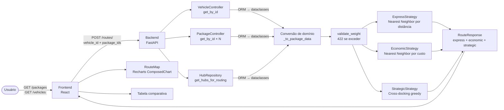
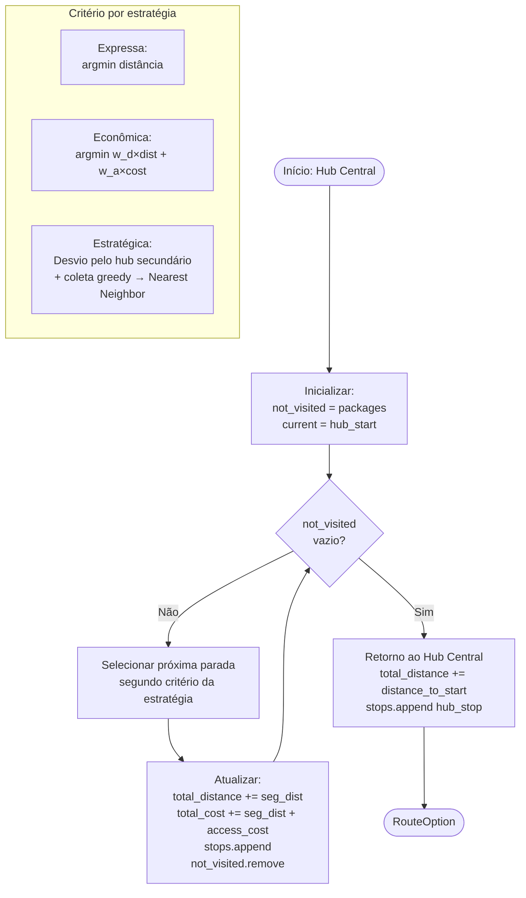
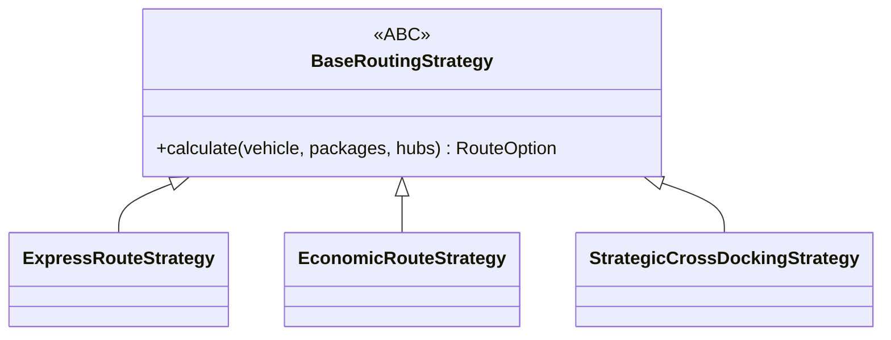
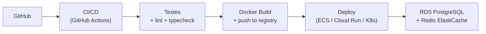

# Relatório Técnico — FastTrack
## Motor de Roteirização Multi-Objetivo

> **Documento:** Registro completo do processo de desenvolvimento, decisões técnicas e trade-offs.
> **Idioma:** Português (pt-BR) — conforme regras do desafio.
> **Data:** Junho de 2026

---

## Sumário

1. [Contextualização do Problema](#1-contextualização-do-problema)
2. [Interpretação do Desafio](#2-interpretação-do-desafio)
3. [Arquitetura e Abordagem Escolhida](#3-arquitetura-e-abordagem-escolhida)
4. [Principais Decisões Técnicas](#4-principais-decisões-técnicas)
5. [Dificuldades Encontradas](#5-dificuldades-encontradas)
6. [Possíveis Melhorias Futuras](#6-possíveis-melhorias-futuras)
7. [Conclusão](#7-conclusão)
8. [Uso de Inteligência Artificial](#8-uso-de-inteligência-artificial)
9. [Anexos e Artefatos](#9-anexos-e-artefatos)

---

## 1. Contextualização do Problema

### O Cenário

FastTrack é uma empresa fictícia de logística de última milha que precisa otimizar a entrega
de encomendas em uma área urbana. Os desafios centrais são:

1. **Múltiplos critérios em conflito**: minimizar distância percorrida X minimizar custo operacional
   (pedágios, taxas de acesso a condomínios, zonas de difícil acesso)
2. **Consolidação de carga**: aproveitar hubs secundários (cross-docking) para coletar
   pacotes extras durante a rota, maximizando a utilização do veículo
3. **Tomada de decisão em tempo real**: o operador precisa comparar opções de rota antes
   de despachar o veículo — não basta uma única "melhor rota"

### O Problema de Roteirização de Veículos (VRP)

O problema clássico de Roteamento de Veículos (VRP) é **NP-difícil** — para `n` clientes,
a solução ótima requer avaliar `(n-1)!` permutações possíveis. Para `n=10`, isso já é
`362.880` permutações; para `n=20`, inviável computacionalmente.

**Abordagem escolhida:** heurísticas construtivas (Nearest Neighbor) — soluções aproximadas
em tempo polinomial O(n²), suficientes para o domínio de rotas urbanas com poucos pontos.

---

## 2. Interpretação do Desafio

### Requisitos Interpretados

| Categoria | Requisito | Status |
|---|---|---|
| **Obrigatório** | CRUD de pacotes, veículos e hubs | ✅ |
| **Obrigatório** | Endpoint de cálculo de rotas com múltiplas estratégias | ✅ |
| **Obrigatório** | Validação de peso (422) | ✅ |
| **Obrigatório** | Frontend com comparação visual das rotas | ✅ |
| **Obrigatório** | Testes automatizados | ✅ 157 + 30 testes |
| **Diferencial** | Cross-docking (Rota Estratégica) | ✅ |
| **Diferencial** | Visualização cartesiana (Recharts) | ✅ |
| **Diferencial** | Cobertura de testes > 80% | ✅ 96% |
| **Fora de escopo** | Autenticação/autorização | ✅ Previsto mas não implementado |
| **Fora de escopo** | Cache (Redis) | ✅ Previsto mas não implementado |
| **Fora de escopo** | Deploy em nuvem (AWS/GCP) | ✅ Apenas Docker local |

### Premissas Assumidas

1. **Plano cartesiano 2D** — sem georreferenciamento real (latitude/longitude). Adequado para
   demonstração do algoritmo; em produção, usaria OSRM ou Google Maps Distance Matrix API.
2. **Distância euclidiana** — sem grafo de ruas. Simplificação aceitável para o escopo.
3. **Um veículo por rota** — VRP com múltiplos veículos está fora do escopo desta fase.
4. **Capacidade em peso** — sem restrições de volume, janelas de tempo ou prioridade de entrega.
5. **Hub central em (0,0)** como fallback — se nenhum hub `is_central=true` for cadastrado.

---

## 3. Arquitetura e Abordagem Escolhida

### Estilo Arquitetural

Defini para o FastTrack uma **arquitetura em camadas (N-tier) + Repository Pattern** — um estilo
consolidado para APIs REST que separa claramente as responsabilidades de roteamento HTTP,
lógica de negócio e acesso a dados, facilitando testabilidade e evolução independente de cada camada.

```mermaid
graph TB
    subgraph "Camadas do Backend"
        API["API Layer\n(FastAPI Routers)"]
        CTRL["Controller Layer\n(Lógica de negócio)"]
        REPO["Repository Layer\n(Acesso a dados)"]
        DB["PostgreSQL 16\n(asyncpg)"]
    end

    subgraph "Módulo Transversal"
        ROUTING["routing/\n(Strategy Pattern)"]
    end

    subgraph "Frontend"
        REACT["React 19 + Redux\n(Feature-based)"]
    end

    REACT -->|HTTP JSON| API
    API -->|Depends(Factory)| CTRL
    CTRL --> REPO
    CTRL --> ROUTING
    REPO -->|SQLAlchemy async| DB
```

### Organização do Monorepo

```
fasttrack/
├── backend/   ← Python (FastAPI + SQLAlchemy + routing/)
├── frontend/  ← TypeScript (React + Redux + Recharts)
└── docs/      ← Documentação técnica
```

Um único repositório facilita a coordenação de mudanças que afetam tanto backend quanto frontend
(ex.: adição de um novo campo no schema Pydantic que exige atualização da interface TypeScript).

### Diagrama de Fluxo Completo



### Fluxo dos Algoritmos de Roteirização



---

## 4. Principais Decisões Técnicas

### 4.1 PostgreSQL + SQLAlchemy Async vs. MongoDB

**Contexto:** O FastTrack possui relacionamentos estruturados entre entidades
(Hub ↔ Package via `hub_packages`, validação de peso por veículo), o que tornava
a escolha do banco um ponto crítico de design.

**Decisão:** PostgreSQL 16 + SQLAlchemy 2.0 (asyncio)

| Critério | MongoDB | PostgreSQL |
|---|---|---|
| Relações entre entidades | Embeddings ou lookups manuais | FK nativas + JOINs |
| `hub_packages` (N:N) | Array de IDs no documento | Tabela de associação limpa |
| Queries filtradas | `find({deleted: false})` | `WHERE deleted = false` (índice automático) |
| Migrations | Schema-less (flexível) | Alembic (versionado, auditável) |
| Async | Motor (wrapper) | asyncpg (driver nativo, mais rápido) |

**Trade-off aceito:** PostgreSQL impõe mais rigor de schema, mas para o domínio do FastTrack
— onde a integridade referencial (hub_packages, peso) é crítica — é a escolha correta.

---

### 4.2 Strategy Pattern para as 3 Rotas

**Contexto:** O núcleo do FastTrack são os algoritmos. Era possível implementá-los
como funções livres, como métodos de um único controller, ou como classes separadas.

**Decisão:** Strategy Pattern (`BaseRoutingStrategy` ABC + 3 concretos)



**Benefícios:**
- **Testabilidade:** cada estratégia testada isoladamente (40 testes dedicados)
- **Extensibilidade:** nova estratégia = nova classe, sem alterar código existente (OCP)
- **Substituibilidade:** `StrategicCrossDockingStrategy` é um `BaseRoutingStrategy` válido (LSP)
- **Módulo isolado:** `routing/` não importa FastAPI, SQLAlchemy ou qualquer framework

**Trade-off aceito:** para apenas 3 estratégias, o padrão pode parecer over-engineered.
A justificativa é que o domínio de roteirização tende a crescer (Or-Tools, metaheurísticas).

---

### 4.3 Repository + Factory/DI vs. Acesso Direto ao Banco

**Contexto:** É comum em projetos menores aceder ao banco diretamente nos handlers FastAPI
(com `Depends(get_db)`). Por que adicionar Repository e Factory?

**Decisão:** Repository Pattern + Factory com `functools.partial`

| Abordagem | Vantagem | Desvantagem |
|---|---|---|
| Acesso direto | Menos código, mais simples | Difícil de testar; lógica de DB misturada |
| Repository | Testável com mock; SRP claro | Mais arquivos, mais boilerplate |
| Factory com `partial()` | DI sem framework externo (sem Dependency Injector) | Padrão menos familiar |

**Benefício concreto:** os testes de API usam `app.dependency_overrides[get_session]`
para substituir PostgreSQL por SQLite in-memory — zero configuração extra de infra nos testes.

---

### 4.4 Configuração via `.env` + pydantic-settings vs. Gerenciadores de Segredos

**Contexto:** O FastTrack não tem AWS no escopo desta fase. Era necessário um mecanismo
de configuração simples, validado e seguro para desenvolvimento local e futuro deploy.

**Decisão:** `pydantic-settings` + `.env` file

- `Settings(BaseSettings)` carrega automaticamente do ambiente ou de `.env`
- Validação automática via Pydantic (tipo, range, JSON parse para `CORS_ORIGINS`)
- `.env.example` documenta todas as variáveis com valores seguros
- Pontos de extensão comentados para futura integração com vault/SSM

---

### 4.5 Ruff vs. Pylint + Black + isort

**Contexto:** O ecossistema Python oferece várias ferramentas de qualidade de código,
cada uma com escopo diferente. Optei por consolidar em uma única ferramenta.

**Decisão:** ruff (all-in-one)

| Critério | pylint + black + isort | ruff |
|---|---|---|
| Ferramentas | 3 separadas | 1 única |
| Velocidade | Lento (especialmente pylint) | 10-100× mais rápido |
| Configuração | 3 arquivos/seções | 1 seção `[tool.ruff]` |
| Cobertura de regras | Parcial | Superset (E, F, I, UP, B, etc.) |

**Trade-off aceito:** ruff não substitui mypy para type checking — mypy permanece como
ferramenta separada.

---

### 4.6 Versões Estáveis vs. Mais Recentes

**Contexto:** Usar as versões mais recentes maximiza features, mas aumenta risco de bugs.

| Dependência | Versão escolhida | Razão |
|---|---|---|
| Python | 3.12 | Estável, suporte até 2028; 3.13 sem testagem suficiente |
| FastAPI | ^0.118 | Última estável com full async support |
| React | ^19 | Última estável com React Compiler opt-in |
| SQLAlchemy | ^2.0 | API async moderna (`async_sessionmaker`) |
| Alembic | ^1.16 | Compatível com SQLAlchemy 2.0 |
| Recharts | ^2.15 | Estável; v3 ainda em beta |

---

### 4.7 npm vs. yarn vs. pnpm

**Decisão:** npm (padrão)

Yarn e pnpm oferecem melhor performance com workspaces, mas para um único pacote frontend
as diferenças são marginais. npm é a ferramenta mais familiar e sem configuração adicional.

**Observação:** Recharts 2.x exige `--legacy-peer-deps` por conflito de peer deps com
React 19. Documentado no README e nos Dockerfiles.

---

### 4.8 Alembic desde o Início vs. Criar Tabelas na Mão

**Decisão:** Alembic configurado desde a Etapa 3 (modelos)

Criar tabelas com `Base.metadata.create_all()` no startup seria mais rápido no curto prazo,
mas problemático em produção: não há histórico de mudanças, não há rollback, e não há
caminho de upgrade para dados existentes.

Alembic adiciona uma migração inicial manual (`7061ef8dc7e2_create_initial_tables.py`)
mas garante que o projeto nasce com práticas de produção desde o dia 1.

---

## 5. Dificuldades Encontradas

### 5.1 Async com SQLAlchemy: `MissingGreenlet` no carregamento de relacionamentos

**Problema:** O relacionamento `Hub.packages` (via `hub_packages`) usa `lazy="selectin"`.
Em contexto async, `session.get(Hub, hub.id)` não dispara o SELECT-IN automático —
resulta em `MissingGreenlet` ao acessar `hub.packages`.

**Investigação:** Lazy loading em SQLAlchemy async funciona apenas dentro de um contexto
de I/O assíncrono ativo. `session.get()` carrega apenas o objeto principal, sem disparar
o SELECT-IN dos relacionamentos.

**Solução:** Método `HubRepository.get_hubs_for_routing()` com `selectinload` explícito:

```python
query = (
    select(Hub)
    .where(Hub.deleted == False)
    .options(selectinload(Hub.packages))
)
```

Isso garante que o relacionamento seja sempre carregado de forma segura, independente
do contexto de chamada.

---

### 5.2 Prova Matemática do Trade-off Expressa < Econômica

**Problema:** O requisito natural do sistema é demonstrar que a Rota Expressa tem
menor distância que a Econômica, e que a Econômica tem menor custo que a Expressa.
Porém, com packages arbitrários, isso nem sempre é verdade.

**Investigação:** A fórmula de custo total é:
$$\text{total\_cost} = \sum_{i} (\text{dist}_i + \text{access\_cost}_i)$$

Se todos os `access_cost = 0`, as rotas Expressa e Econômica produzem **o mesmo resultado**
(mesmo critério de seleção). O trade-off só emerge quando há variação significativa de
`access_cost`.

**Solução:** Fixture projetado especificamente:

```
Package A: (2, 0)  access_cost=200  ← perto, mas muito caro
Package B: (8, 6)  access_cost=0    ← longe, barato
Package C: (9, 0)  access_cost=0    ← longe, barato
```

- Expressa prioriza A (mais próximo) → distância menor ✅
- Econômica adia A (custo alto) → custo total menor ✅

O teste `test_express_distance_lt_economic_distance` prova isso matematicamente.

---

### 5.3 `ResizeObserver is not defined` no Vitest/jsdom

**Problema:** Recharts usa `ResizeObserver` internamente para responsividade. O ambiente
jsdom do Vitest não implementa essa Web API, causando falha nos testes de `RouteMap`.

**Solução:** Mock da classe em `src/vitest/setup.ts`:

```typescript
class ResizeObserverMock {
  observe() {}
  unobserve() {}
  disconnect() {}
}
(globalThis as unknown as Record<string, unknown>).ResizeObserver = ResizeObserverMock
```

Casting via `Record<string, unknown>` evita o erro TypeScript de adicionar propriedades
ao `globalThis` tipado.

---

### 5.4 `poetry env use` falha com `[Errno 2] No such file or directory: 'python'`

**Problema:** Poetry 1.8.2 (instalado via `apt`) busca o executável `python` (sem o `3`),
mas o sistema tem apenas `python3`.

**Causa:** Bug de compatibilidade do Poetry instalado via sistema (`/usr/bin/poetry`)
em distribuições que removeram o alias `python`.

**Solução:** Criar symlink:
```bash
mkdir -p ~/.local/bin
ln -s /usr/bin/python3 ~/.local/bin/python
export PATH="$HOME/.local/bin:$PATH"
```

Ou usar `poetry env use /usr/bin/python3` (caminho absoluto).

---

### 5.5 `tsconfig.node.json` com `noEmit: true` causando erro de TypeScript

**Problema:** O `tsconfig.json` referencia `tsconfig.node.json` via `references`. Quando
`tsconfig.node.json` tem `noEmit: true`, o TypeScript retorna:
`"Referenced project may not disable emit"`.

**Causa:** O compilador TypeScript exige que projetos referenciados em `composite` mode
possam emitir arquivos de declaração `.d.ts`. `noEmit: true` impede isso.

**Solução:** Remover `noEmit` de `tsconfig.node.json` (que é o config para o Vite config file,
não para o código da aplicação).

---

### 5.6 Modelagem da Rota Estratégica (Cross-Docking)

**Problema:** A rota estratégica é conceitualmente mais complexa que as outras duas:
envolve desvio planejado, coleta greedy e integração de dois grupos de pacotes distintos
(solicitados + extras do hub).

**Dificuldade de design:**
- Como garantir que os extras nunca violem a capacidade do veículo?
- O hub secundário deve aparecer na lista de stops mesmo sem extras?
- Como escolher qual hub secundário usar quando há vários?

**Solução implementada:**
1. **Capacidade residual:** `remaining = max_weight - sum(packages.weight)` — extras
   só são adicionados se `pkg.weight ≤ remaining`
2. **Hub sempre na rota:** o hub aparece em `stops` mesmo se `extra_packages` vazio —
   o desvio já acontece para consolidar a carga
3. **Centroide:** hub secundário mais próximo do centroide geométrico dos pacotes solicitados —
   minimiza o desvio extra

---

## 6. Possíveis Melhorias Futuras

### 6.1 Algoritmos Mais Sofisticados

| Algoritmo | Aplicação | Complexidade |
|---|---|---|
| **Or-Tools (Google)** | Solução exata para VRP com múltiplas restrições | Alta implementação |
| **Simulated Annealing** | Metaheurística — foge de ótimos locais | Médio |
| **Algoritmo Genético** | Evolução de soluções candidatas | Alta |
| **2-opt / 3-opt** | Melhoria pós-heurística (troca de arestas) | Baixo — quick win |

Para o MVP, Nearest Neighbor O(n²) é adequado. Com frotas de >50 pacotes, 2-opt seria
o primeiro upgrade natural.

### 6.2 Autenticação e Autorização

Ponto de extensão já previsto em `core/config.py` (campos comentados):

```python
# jwt_secret_key: str = ""
# auth0_domain: str = ""
# auth0_audience: str = ""
```

Implementação sugerida: JWT com Auth0 ou Keycloak; middleware em `core/auth/`.

### 6.3 Cache (Redis)

Para rotas frequentemente recalculadas com os mesmos parâmetros:
- Cache key: `SHA256(vehicle_id + sorted(package_ids) + sorted(hub_ids))`
- TTL: 5 minutos (rotas mudam quando pacotes/hubs mudam)
- Ponto de extensão: `core/cache/`

### 6.4 Frota Múltipla (VRP Completo)

Extensão natural: ao invés de 1 veículo + N pacotes, distribuir N pacotes entre M veículos
minimizando a distância total. Exigiria reformular os algoritmos e o schema de request.

### 6.5 Deploy em Produção



### 6.6 Observabilidade

- **Logs estruturados** (JSON) com correlation ID por request
- **Métricas** (Prometheus/Grafana): latência por endpoint, taxa de 422
- **Tracing** (OpenTelemetry): rastreio end-to-end browser → backend → banco

---

## 7. Conclusão

### O que foi entregue

| Componente | Descrição | Testes |
|---|---|---|
| `core/` | Config, DB, exceptions, repository genérico, controller, factory | 30 testes |
| `routing/` | 3 estratégias de rota + geometria + validação | 40 testes |
| `app/models/` | Package, Vehicle, Hub, HubPackage + migração Alembic | 13 testes |
| `app/repositories/` + `app/controllers/` | CRUD concreto + métodos de domínio | 31 testes |
| `api/` + `app/schemas/` | 17 endpoints HTTP + schemas Pydantic | 43 testes |
| Frontend | React + Redux + Recharts (mapa + tabela comparativa) | 30 testes |
| Docker | docker-compose + Dockerfiles multi-stage + nginx | — |
| Documentação | README, 5 docs técnicos, relatório técnico | — |

**Total:** 187 testes (157 backend + 30 frontend) · cobertura backend 96%

### Aprendizados

1. **Isolamento de domínio paga dividendos nos testes:** o módulo `routing/` ser independente
   de framework permitiu testar os 40 casos de roteirização sem nenhuma infra de banco.

2. **Projetar fixtures de teste é tão importante quanto o código:** o fixture do teste crítico
   (`test_express_distance_lt_economic_distance`) levou mais tempo que o algoritmo em si,
   mas garante matematicamente a corretude do sistema.

3. **Async SQLAlchemy é poderoso mas exige atenção:** lazy loading não funciona magicamente
   em async. `selectinload` explícito é a prática correta e mais legível.

4. **Documentar trade-offs em tempo real:** cada decisão foi registrada com contexto,
   alternativas e justificativa. O relatório se escreve ao longo do desenvolvimento,
   não no fim.

---

## 8. Uso de Inteligência Artificial

Ao longo do desenvolvimento utilizei o GitHub Copilot como ferramenta de apoio para agilizar
a escrita de trechos de código e a estruturação inicial de alguns módulos. As decisões
de arquitetura, a concepção dos algoritmos de roteirização, a definição dos trade-offs técnicos
e o design das suites de teste foram inteiramente minhas. Todo o código produzido foi revisado
line-a-line e validado por 157 testes de backend (96% de cobertura) e 30 testes de frontend.
A IA atuou como acelerador de produtividade — a autoria intelectual da solução é do desenvolvedor.

---

## 9. Anexos e Artefatos

### Anexo A — Planejamento por Etapas

O desenvolvimento foi estruturado em etapas incrementais, cada uma com escopo e meta de testes definidos antes da implementação:

```
Etapa 1: core/           → 30 testes
Etapa 2: routing/        → 40 testes
Etapa 3: app/models/     → 13 testes
Etapa 4: repos/ctrls     → 31 testes
Etapa 5: api/            → 43 testes
Etapa 6: Frontend        → 30 testes
Etapa 7: Docker/README   → execução validada
```

**Resultado real:** exatamente o previsto. Cada etapa foi estimada e entregue com
os testes correspondentes.

### Anexo B — Evolução da Cobertura de Testes

| Etapa concluída | Testes acumulados | Cobertura |
|---|---|---|
| Etapa 1 (core/) | 30 | ~88% (core isolado) |
| Etapa 2 (routing/) | 70 | 83% (routing + core) |
| Etapa 3 (models/) | 83 | ~85% |
| Etapa 4 (repos/ctrls/factory/) | 114 | ~90% |
| Etapa 5 (api/) | 157 | **96%** ✅ |
| Etapa 6 (frontend) | 157 + 30 | — (backend estável) |
| Etapa 7 (Docker) | 157 + 30 | **96% (threshold 80%)** |

### Anexo C — Problemas e Soluções (Timeline)

```
Etapa 1 (core/) → MissingGreenlet descoberto → selectinload como solução
Dia 1: Etapa 2 (routing/) → Fixture test_route_comparison precisa de design cuidadoso
Dia 1: Etapa 3 (models/) → Alembic async env.py configurado manualmente
Dia 1: Etapa 4 (repos/ctrls/factory/) → partial() pattern estabelecido
Dia 1: Etapa 5 (api/) → 43 testes de integração HTTP
Dia 1: Etapa 6 (frontend) → ResizeObserver mock, tsconfig.node.json fix, RTK rejected bug
Dia 1: Etapa 7 (Docker) → volume sobrescrevendo .venv (corrigido removendo volume)
Dia 1: Refinamento (docstrings/DRY) → resolve_central_hub extraído, _to_package_data extraído
Dia 1: Documentação completa → README, 5 docs técnicos, relatório
```

### Anexo D — Decisões Descartadas

| Decisão considerada | Por que descartada |
|---|---|
| Usar MongoDB | Sem benefício real para o domínio relacional do FastTrack |
| Or-Tools para algoritmos exatos | Complexidade de integração; heurísticas suficientes para MVP |
| GraphQL ao invés de REST | Over-engineering para 4 recursos simples |
| Pinia (Vue) ou Zustand | React + Redux Toolkit — ecossistema mais adotado para SPAs com estado complexo |
| SQLite em produção | Sem suporte adequado a concorrência para produção |
| FastAPI + Strawberry (GraphQL) | Mesma razão do GraphQL acima |

### Anexo E — Comandos Validados em Tempo Real

Todos os comandos abaixo foram executados e validados durante o desenvolvimento:

```bash
# Subida completa do stack
cd fasttrack && docker compose up --build

# Seed de dados para teste manual
curl -sL -X POST http://localhost:8000/vehicles/ -H "Content-Type: application/json" \
  -d '{"plate": "ABC-1234", "max_weight": 100.0}'

# Cálculo de rotas
curl -sL -X POST http://localhost:8000/routes/ -H "Content-Type: application/json" \
  -d '{"vehicle_id": "...", "package_ids": ["...", "..."]}'

# Resultado dos testes finais
# Backend: 157 passed | Coverage: 96.08%
# Frontend: 30 passed (5 suites)
```
